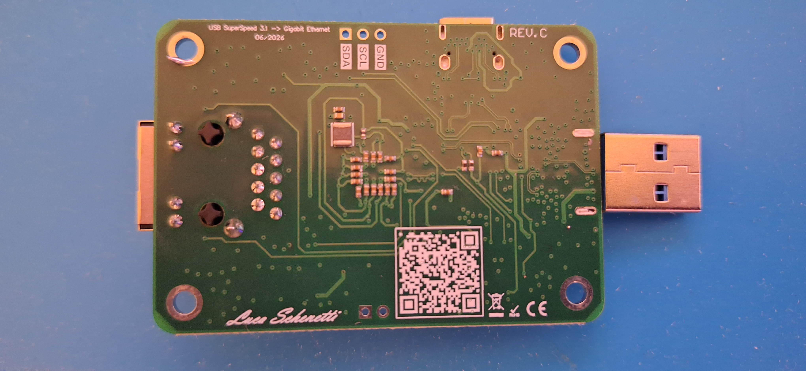
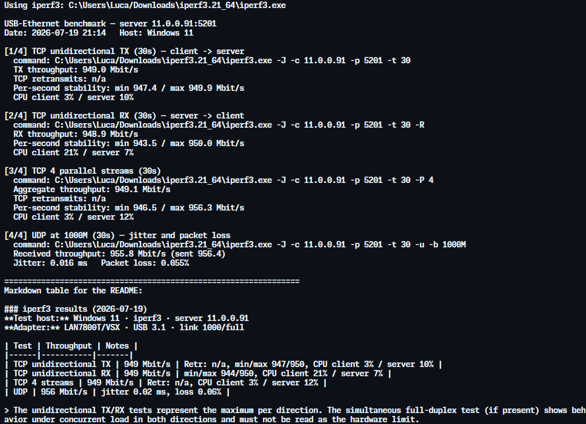

# USB SuperSpeed 3.1 → Gigabit Ethernet (LAN7800)

USB 3.1 Gen 1 (SuperSpeed, 5 Gbit/s) → Gigabit Ethernet adapter based on the
**Microchip LAN7800T/VSX** controller. The board has a **USB-C female** input
and a **USB-A male** output, so it works with both modern USB-C and traditional
USB-A ports. This repository contains the PCB design, production files, and
throughput test results measured with `iperf3`.

*(Versione italiana più in basso — [Italiano](#-adattatore-usb-superspeed-31--gigabit-ethernet-lan7800))*


## Features

- **Microchip LAN7800T/VSX** — USB 3.1 Gen 1 → 10/100/1000 Mbit/s Ethernet controller
- **USB-C female** input and **USB-A male** output — works with both modern
  USB-C ports and traditional USB-A ports
- **HanRun HR911130A** integrated RJ45 jack with magnetics
- Link negotiated at **1000 Mbit/s full-duplex**
- **Line-rate** throughput in both directions (see results below)
- On-board **reset button**, **power LED**, and an **I²C header** (SDA/SCL/GND)
- Bus-powered via USB
- Revision **C** (06/2026)

## Connectors and main components

The board accepts a **USB-C (female)** input and provides a **USB-A (male)**
output. The USB-C side includes full orientation/CC handling:

| Component | Function |
|-----------|----------|
| Microchip **LAN7800T/VSX** | USB 3.1 Gen 1 → Gigabit Ethernet controller |
| Microchip **93AA66C-I/SN** | 4 Kbit serial EEPROM — stores the MAC address and USB configuration (VID/PID, descriptors) for the LAN7800 |
| TI **HD3SS3220RNHR** | USB-C mux/switch with CC logic — handles cable orientation and port role (DRP/DFP/UFP) for the USB-C connector |
| Diodes **PI3USB302-AZBEX** | USB Type-C SuperSpeed data demux/switch — routes the SS lines according to plug orientation |
| TI **TS3USB221ARSER** | USB 2.0 (high-speed) data mux/switch — routes the D+/D− lines according to plug orientation |
| HanRun **HR911130A** | Integrated RJ45 connector with Ethernet magnetics |

Additional on-board features: **RST** reset button, **PWR** power LED, and a
3-pin **I²C** header (SDA / SCL / GND) for debugging or expansion.

## Board

| Front (render) | Back (render) |
|:---:|:---:|
|  |  |

| Front (photo) | Back (photo) |
|:---:|:---:|
|  |  |

## Test results (iperf3)

Tests were run with the [`iperf_benchmark.py`](8-Test_PCB/iperf_benchmark.py) script
included in this repository. The adapter reaches Gigabit Ethernet line rate
(~949 Mbit/s, the practical maximum with standard MTU due to protocol overhead)
in a stable way and with low host CPU usage.

### Windows 11 (bare-metal)

**Test host:** Windows 11 · iperf3 3.21 (64-bit) · server `11.0.0.91`
**Adapter:** LAN7800T/VSX · USB 3.1 · link 1000/full

| Test | Throughput | Notes |
|------|-----------|-------|
| TCP unidirectional TX | 949 Mbit/s | min/max 947/950 · CPU client 3% / server 10% |
| TCP unidirectional RX | 949 Mbit/s | min/max 944/950 · CPU client 21% / server 7% |
| TCP 4 parallel streams | 949 Mbit/s | min/max 946/956 · CPU client 3% / server 12% |
| UDP (1000M) | 956 Mbit/s | jitter 0.02 ms · packet loss 0.06% |



**How to read the results:**

- **Unidirectional TX and RX** represent the maximum per single direction. Both
  are at line rate (~949 Mbit/s) and stable for the whole test duration, with no
  drop over time.
- **Low host CPU** (3–21%): throughput is not CPU-limited. USB→Ethernet adapters
  have no hardware offload, so this is a good efficiency indicator.
- **0.02 ms jitter** and **0.06% packet loss** on UDP saturated at 1 Gbit/s
  indicate an electrically clean link.
- TCP retransmits (`Retr`) are not reported on Windows because the field is not
  populated by the platform in the JSON output; this is normal and not a problem.

> **Note on simultaneous full-duplex:** a `--bidir` test (traffic in both
> directions at the same time) shows an asymmetry between TX and RX. This is the
> expected behavior of a USB→Ethernet adapter: without hardware offload, the two
> directions share the USB bus and CPU, and one prevails over the other under
> concurrent load. **This is not a hardware limit** — measured individually,
> both directions reach line rate, as shown in the table.

## Reproducing the tests

You need a second machine acting as the iperf3 server:

```bash
# On the server machine
iperf3 -s
```

```bash
# On the client machine (with the adapter under test)
python iperf_benchmark.py <SERVER_IP> --duration 30 --chip "LAN7800T/VSX · USB 3.1 · link 1000/full"
```

Useful options:

- `--duration N` — duration of the unidirectional TCP tests (default 60s)
- `--quick` — short 10s tests for a quick check
- `--bidir` — adds the simultaneous full-duplex test (extra, requires iperf3 ≥ 3.7)
- `--streams N` — number of parallel streams (default 4)
- `--iperf3 PATH` — path to the executable if not in PATH

The script prints the results and generates a Markdown table ready to paste.

### Notes on the test environment

For reliable numbers, run the tests from a **bare-metal operating system**, not
from a virtual machine. In a VM, hypervisor scheduling and virtual networking
can introduce throughput drops and asymmetries unrelated to the hardware under
test. The results above come from Windows 11 installed directly on the PC.

## Repository contents

```
Lan7800-Usb-Ethernet/
├── 1-Draw/                  Altium project — schematics (.SchDoc) and PCB layout (.PcbDoc)
├── 3-Gerber File & BOM/     Gerber files (Rev. A/B/C), BOM and pick-and-place (CPL)
├── 5-Driver/               EEPROM images (MAC address / USB configuration)
├── 7-Spec/                 Component datasheets (LAN7800, HD3SS3220, ...)
├── 8-Test_PCB/             iperf3 benchmark script and its README
├── 9-Images/               Board renders and photos
├── LICENSE
└── README.md
```

The Altium `History/` folder (automatic backups) is intentionally excluded via
`.gitignore` — it is not needed to build or use the project.

## License

Released under the **MIT License** — see the [LICENSE](LICENSE) file for details.

---
---

# 🇮🇹 Adattatore USB SuperSpeed 3.1 → Gigabit Ethernet (LAN7800)

Adattatore USB 3.1 Gen 1 (SuperSpeed, 5 Gbit/s) → Gigabit Ethernet basato sul
controller **Microchip LAN7800T/VSX**. La scheda ha un ingresso **USB-C
femmina** e un'uscita **USB-A maschio**, quindi funziona sia su porte USB-C
moderne sia su porte USB-A tradizionali. Questo repository contiene il progetto
del PCB, i file di produzione e i risultati dei test di throughput eseguiti con
`iperf3`.

*(English version above — [English](#usb-superspeed-31--gigabit-ethernet-lan7800))*


## Caratteristiche

- **Microchip LAN7800T/VSX** — controller USB 3.1 Gen 1 → 10/100/1000 Mbit/s Ethernet
- Ingresso **USB-C femmina** e uscita **USB-A maschio** — utilizzabile sia su
  porte USB-C moderne sia su porte USB-A tradizionali
- Connettore RJ45 integrato con magnetics **HanRun HR911130A**
- Link negoziato a **1000 Mbit/s full-duplex**
- Throughput a **line rate** in entrambe le direzioni (vedi risultati sotto)
- **Pulsante di reset**, **LED di alimentazione** e **header I²C** (SDA/SCL/GND) a bordo
- Alimentazione via bus USB
- Revisione **C** (06/2026)

## Connettori e componenti principali

La scheda accetta un ingresso **USB-C (femmina)** e fornisce un'uscita **USB-A
(maschio)**. Il lato USB-C include la gestione completa dell'orientamento/CC:

| Componente | Funzione |
|------------|----------|
| Microchip **LAN7800T/VSX** | Controller USB 3.1 Gen 1 → Gigabit Ethernet |
| Microchip **93AA66C-I/SN** | EEPROM seriale da 4 Kbit — memorizza il MAC address e la configurazione USB (VID/PID, descrittori) per il LAN7800 |
| TI **HD3SS3220RNHR** | Mux/switch USB-C con logica CC — gestisce l'orientamento del cavo e il ruolo della porta (DRP/DFP/UFP) per il connettore USB-C |
| Diodes **PI3USB302-AZBEX** | Demux/switch dati SuperSpeed USB Type-C — instrada le linee SS in base all'orientamento del connettore |
| TI **TS3USB221ARSER** | Mux/switch dati USB 2.0 (high-speed) — instrada le linee D+/D− in base all'orientamento del connettore |
| HanRun **HR911130A** | Connettore RJ45 integrato con magnetics Ethernet |

Altre feature a bordo: pulsante di reset **RST**, LED di alimentazione **PWR** e
un header **I²C** a 3 pin (SDA / SCL / GND) per debug o espansione.

## Scheda

| Fronte (render) | Retro (render) |
|:---:|:---:|
|  |  |

| Fronte (foto) | Retro (foto) |
|:---:|:---:|
|  |  |

## Risultati dei test (iperf3)

I test sono stati eseguiti con lo script [`iperf_benchmark.py`](8-Test_PCB/iperf_benchmark.py)
incluso nel repository. L'adattatore raggiunge il line rate di Gigabit Ethernet
(~949 Mbit/s, il massimo pratico con MTU standard per via dell'overhead di
protocollo) in modo stabile e con CPU dell'host bassa.

### Windows 11 (bare-metal)

**Host di test:** Windows 11 · iperf3 3.21 (64-bit) · server `11.0.0.91`
**Adattatore:** LAN7800T/VSX · USB 3.1 · link 1000/full

| Test | Throughput | Note |
|------|-----------|------|
| TCP unidirezionale TX | 949 Mbit/s | min/max 947/950 · CPU client 3% / server 10% |
| TCP unidirezionale RX | 949 Mbit/s | min/max 944/950 · CPU client 21% / server 7% |
| TCP 4 stream paralleli | 949 Mbit/s | min/max 946/956 · CPU client 3% / server 12% |
| UDP (1000M) | 956 Mbit/s | jitter 0.02 ms · packet loss 0.06% |


**Lettura dei risultati:**

- **TX e RX unidirezionali** rappresentano il massimo per singola direzione.
  Entrambi sono a line rate (~949 Mbit/s) e stabili per tutta la durata del
  test, senza cali nel tempo.
- **CPU dell'host bassa** (3–21%): il throughput non è limitato dalla CPU, e gli
  adattatori USB→Ethernet non dispongono di offload hardware, quindi questo è un
  buon indicatore di efficienza.
- **Jitter di 0.02 ms** e **packet loss dello 0.06%** su UDP saturato a 1 Gbit/s
  indicano un link elettricamente pulito.
- Le ritrasmissioni TCP (`Retr`) non sono riportate su Windows perché il campo
  non viene popolato dalla piattaforma nell'output JSON; è normale e non indica
  un problema.

> **Nota sul full-duplex simultaneo:** un test `--bidir` (traffico in entrambe le
> direzioni contemporaneamente) mostra un'asimmetria tra TX e RX. Questo è il
> comportamento atteso di un adattatore USB→Ethernet: senza offload hardware, le
> due direzioni condividono bus USB e CPU e una prevale sull'altra sotto carico
> simultaneo. **Non è un limite dell'hardware** — misurate singolarmente,
> entrambe le direzioni raggiungono il line rate, come mostrato nella tabella.

## Riprodurre i test

Serve una seconda macchina che faccia da server iperf3:

```bash
# Sulla macchina server
iperf3 -s
```

```bash
# Sulla macchina client (con l'adattatore da testare)
python iperf_benchmark.py <IP_SERVER> --duration 30 --chip "LAN7800T/VSX · USB 3.1 · link 1000/full"
```

Opzioni utili:

- `--duration N` — durata dei test TCP unidirezionali (default 60s)
- `--quick` — test brevi da 10s per una prova rapida
- `--bidir` — aggiunge il test full-duplex simultaneo (extra, richiede iperf3 ≥ 3.7)
- `--streams N` — numero di stream paralleli (default 4)
- `--iperf3 PERCORSO` — percorso dell'eseguibile se non è nel PATH

Lo script stampa i risultati e genera una tabella Markdown pronta da incollare.

### Note sull'ambiente di test

Per numeri affidabili, esegui i test da **sistema operativo bare-metal**, non da
una macchina virtuale. In una VM lo scheduling dell'hypervisor e il networking
virtuale possono introdurre cali di throughput e asimmetrie che non dipendono
dall'hardware testato. I risultati qui sopra provengono da Windows 11 installato
direttamente sul PC.

## Contenuto del repository

```
Lan7800-Usb-Ethernet/
├── 1-Draw/                  Progetto Altium — schematici (.SchDoc) e layout PCB (.PcbDoc)
├── 3-Gerber File & BOM/     File Gerber (Rev. A/B/C), BOM e pick-and-place (CPL)
├── 5-Driver/               Immagini EEPROM (MAC address / configurazione USB)
├── 7-Spec/                 Datasheet dei componenti (LAN7800, HD3SS3220, ...)
├── 8-Test_PCB/             Script di benchmark iperf3 e relativo README
├── 9-Images/               Render e foto della scheda
├── LICENSE
└── README.md
```

La cartella Altium `History/` (backup automatici) è volutamente esclusa tramite
`.gitignore` — non serve per costruire o usare il progetto.

## Licenza

Distribuito con **licenza MIT** — vedi il file [LICENSE](LICENSE) per i dettagli.
